### *Guess how many OS Engine forks I saw Marge? 160!* - Homer J. Simpson

# Friday Night Funkin' OS Engine - NEW 0.6.3 UPDATE!
       

## Installation:

Refer to the [Building Instructions.](https://github.com/FuseIsHere813/FNF-OSEngine-New/wiki/Library-Versions)

If you don't want your mod to be able to run .lua scripts, delete the "LUA_ALLOWED" line on Project.xml

If you get an error about StatePointer when using Lua, run `haxelib remove linc_luajit` into Command Prompt/PowerShell, then re-install linc_luajit.

## OS Engine Credits:
* [weuz_](https://github.com/notweuz) - Original Owner / Lead Programmer
* [nelifs](https://github.com/nelifs) - Main Designer / Programmer
* [Cooljer](https://github.com/cooljer) - Main Artist / Winning Icons

### OS Engine Special Thanks
* [Fuse](https://github.com/FuseIsHere813) - 0.6.3 PORT HEH-, and his smart brain for more customizable options.
* [JSE Team (Jordan Santiago/Moxie)](https://github.com/JordanSantiagoYT/FNF-JS-Engine) - For the Note Spam System in JS Engine
* [Vs. Dave And Bambi)](https://twitter.com/vsdaveandbambi) - Rainbow Eyesores/Wavy Background Code
* [ExpungedGaming6969](youtube.com/@ExpungedGaming6969) - New Ideas for Engine / Goat.
* [jonnycat](https://github.com/McJonnycat) - Fixing bugs in Engine <3.
* [Kade Engine](https://gamebanana.com/mods/44291) - Circle Note Skin.

## Psych Engine Credits:
* Shadow Mario - Programmer
* Riveren - Artist

### Psych Engine Special Thanks
* bbpanzu - Ex-Programmer
* SqirraRNG - Crash Handler and Base code for Chart Editor's Waveform
* KadeDev - Fixed some cool stuff on Chart Editor and other PRs
* iFlicky - Composer of Psync and Tea Time, also made the Dialogue Sounds
* PolybiusProxy - .MP4 Video Loader Library (hxCodec)
* Keoiki - Note Splash Animations
* Smokey - Sprite Atlas Support
* Nebula the Zorua - Old/Former LuaJIT Fork, Global Mods, Lua reworks, VCR Shader code
* superpowers04 - For the New/Current LuaJIT fork
_____________________________________

## OS Engine Features

OS Engine is a fork of [Psych Engine](https://github.com/shadowmario/psychengine/tag/0.6.2), so it does support mods, like the original.

Not only that, it brings new features for this modfication, making mods more user-friendly, and of course, more VDAB friendly too.

More features will be added later (For contribution, please make a pull request with your desired change. It will be reviewed).

### Note Skins
OS Engine adds the circle noteskin only for right, soon we will add another skin in reference to osu!mania.
Select your desired in the Options Menu.

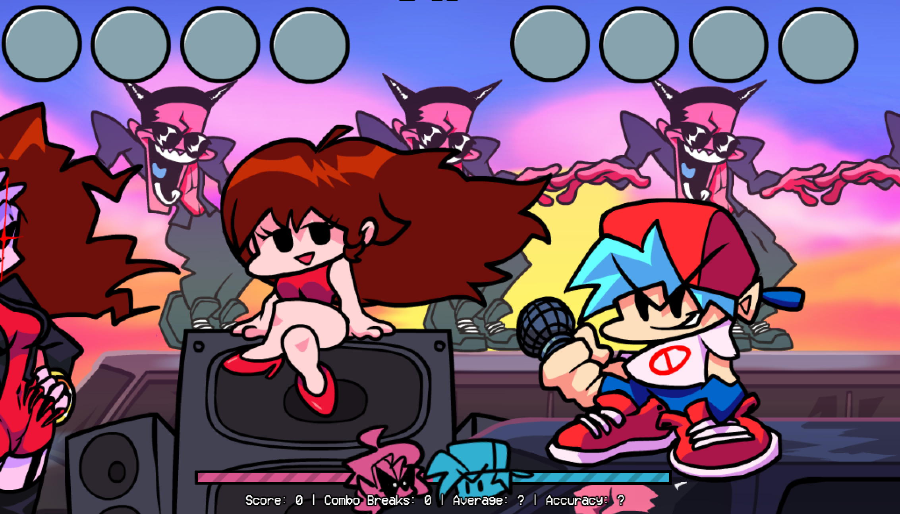

### Showcase Mode
This feature hides HUD and enables botplay. So you can showcase any mod without any problems.

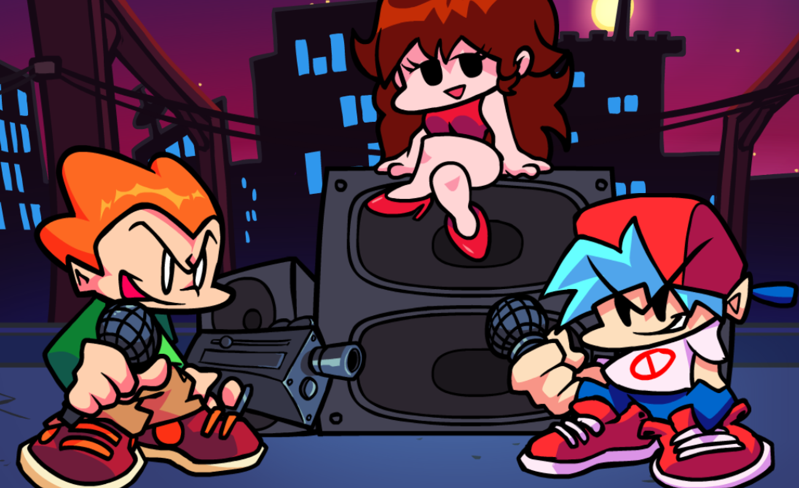

### Score HUD Style
Brought back the Psych Engine look, and added the original look used from OS Engine itself.
(cry about it weuz /j)

You can select either the "Simple" or "Normal" option in the Visuals & UI section in the options menu.

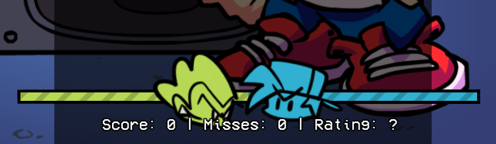
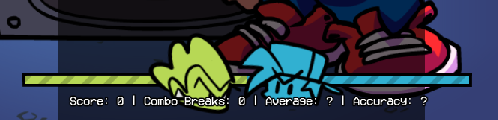

### Perfect! Judgement
Adds the "Perfect!" Judgement, to get this rating, you must hit a note better than "Sick!".
Can be left/removed under the "Gameplay" section in the Options menu.

### Lane Underlay
You can set lane underlay transparency under the player's notes, transparency settings can be modified in value.
Also works with the opponent notes too somehow lo-

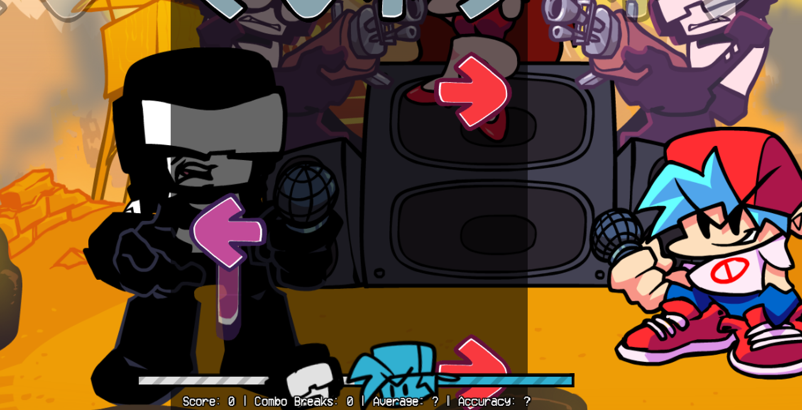

### Custom Settings in Chart Editor.
There's multiple new functions in chart editor. Like player/opponent trail, camera move and etc.

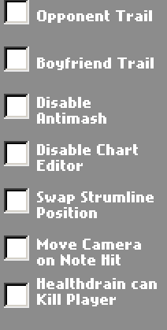

### Literally Useless Exit Game State
Now you can press ESC at the title screen, and it will ask you if you wanna quit or not.

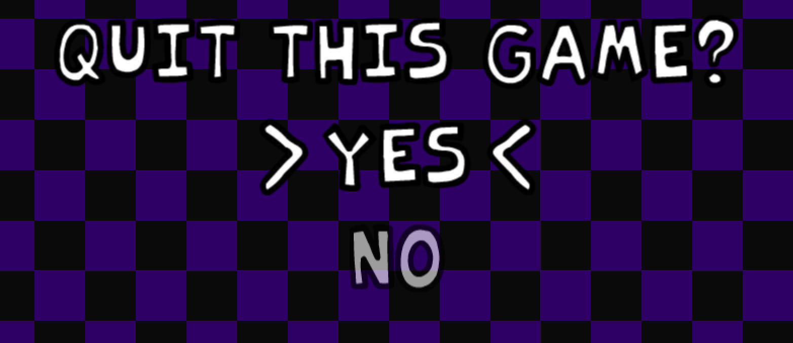

### Improved Main Menu State

Nothing much, but kept from the latest official version. (1.5.1)

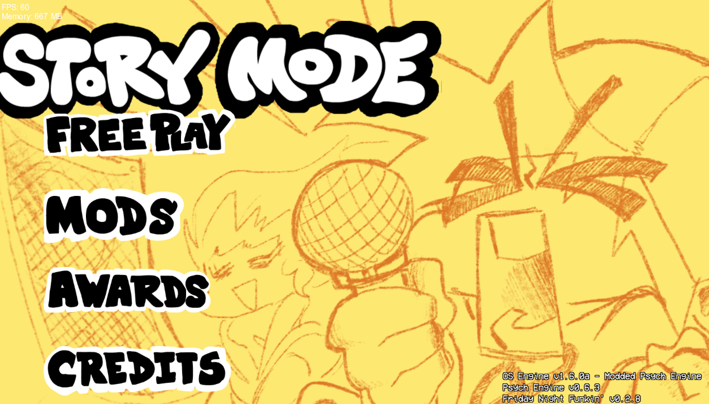

### Winning icons 
Instead of 2 icons, there'll be three icons (losing, normal, winning). And yes, you can use double icons (without winning).

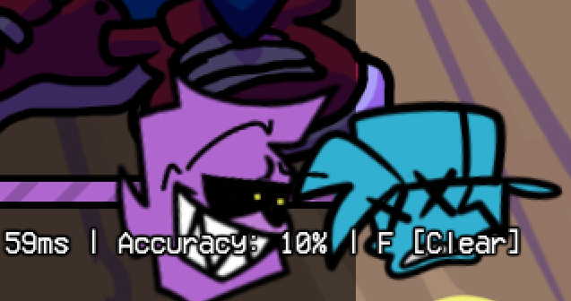
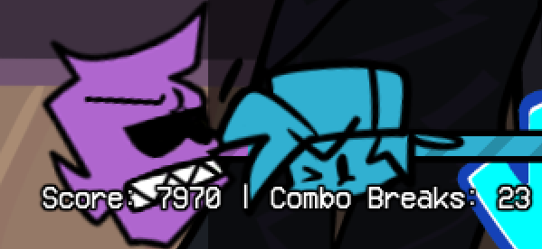

*thanks Cooljer for remaking original fnf icons lol*

### Shaders
Shaders were re-added from VDAB, and of course, with runtime support too. Now you can all enjoy making those funni spamtrack mods lo- /j

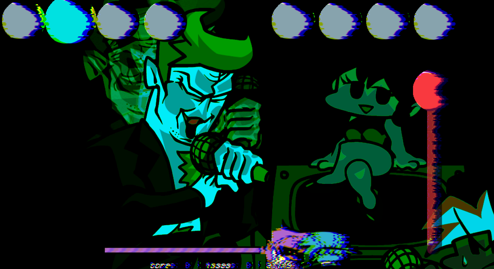

### Improved Title State
Added a background to the Title State. 

"Now it looks way more better". - notweuz_ 2022

The background will be JSON editable soon, for now it can be safe to be left/removed using source code.

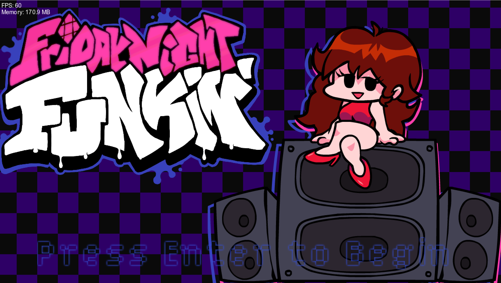

### Striped Health Bar
Cassette Girl vibes?

